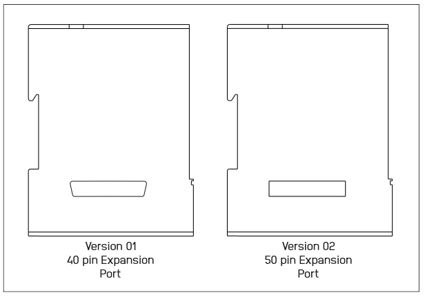

#  Changelog

All notable changes to the **NORVI CPU-ESPS3** series (X1, X2, X3) are documented in this file.

Format based on [Keep a Changelog](https://keepachangelog.com/en/1.0.0/).

---

##  Version 02

> Applies to **CPU-ESPS3-X1**, **CPU-ESPS3-X2**, and **CPU-ESPS3-X3**

### 1️⃣  Expansion Port: 40 Pins → 50 Pins

| Detail | Version 01 | Version 02 |
|---|---|---|
| Total pins | 40 | **50** |
| New pins added | — | Pins 43–50, including additional **GND**, **24V**, and **IO36** lines |
| Layout | Fixed 40-pin header | Fully reassigned 50-pin header - pin-for-pin layout is **not backward compatible** |
| Power pins | Single 24V / GND pair at end | Extra 24V / GND pairs added for better power distribution across the header |

### 2️⃣  GPIO Changes

| Detail | Version 01 | Version 02 |
|---|---|---|
| Core SPI bus (MOSI/MISO/SCLK) | `IO35 / IO37 / IO36` | **`IO11 / IO13 / IO12`** |
| TFT Display CS | `IO47` (CS) | **`IO45` (DIS_CS)** |
| TFT Display RST | `IO45` (RST) | **`IO47` (DIS_RST / TP_RST)** |
| TFT Display DC | `IO46` (DC) | **`IO46` (DIS_DC)** — same pin, renamed |
| Touch controller | Shared SCL/SDA only | Added dedicated **TP_INT** pin |
| SD Card MISO/MOSI/SCLK | `IO37 / IO35 / IO36` | **`IO13 / IO11 / IO12`** |
| GPIO map table columns | GPIO, Utilisation, Type/RTC, Typical Usage | Simplified to **GPIO, Utilisation** only (CPU + Expansion Port columns) |
| N16R8 variant note | Not documented | **New note added:** several GPIOs are unavailable on N16R8 (PSRAM via OPI) variants - standard version only |
| Expansion port GPIO source pins | Mapped to 40-pin layout | Fully remapped to new 50-pin layout (e.g., expansion pin "IO11" now sources from `IO35`, pin "IO12" from `IO41`) |

### 3️⃣ RS-485: RS485-FC Pin Removed

| Detail | Version 01 | Version 02 |
|---|---|---|
| Flow Control / Direction Control Pin | Present - `IO41` (X2/X3) or "Automatically Controlled" (X1) | **Removed** from the RS-485 communication spec table |
| Direction control | Manual/dedicated FC pin | Handled internally by the transceiver (no longer exposed as a GPIO) |
| Affected models | X1, X2, X3 | X1, X2, X3 |

---

## Version 01 — Baseline

| Area | Details |
|---|---|
| 🎉 Initial Release | Covers **CPU-ESPS3-X1**, **CPU-ESPS3-X2**, and **CPU-ESPS3-X3** controllers |
| 🔌 Expansion Port | 40-pin header |
| 📡 RS-485 | Included a dedicated Flow Control / Direction Control pin |

